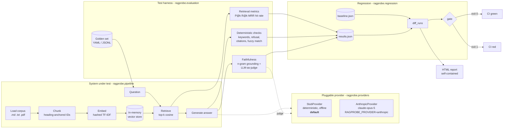
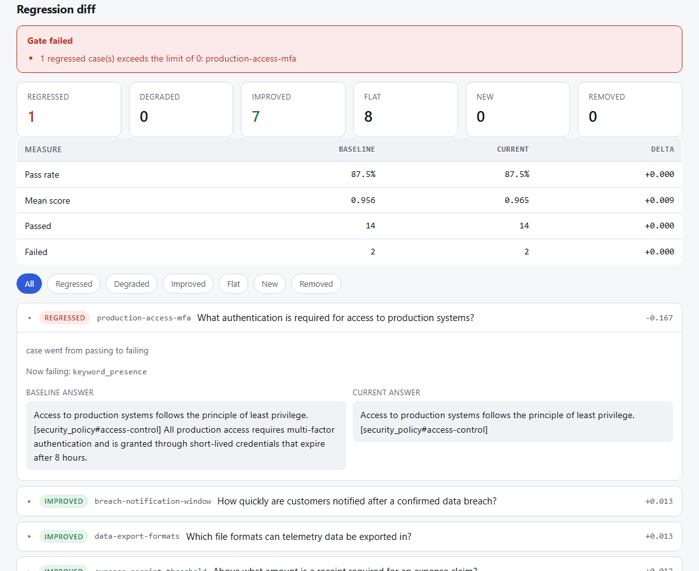
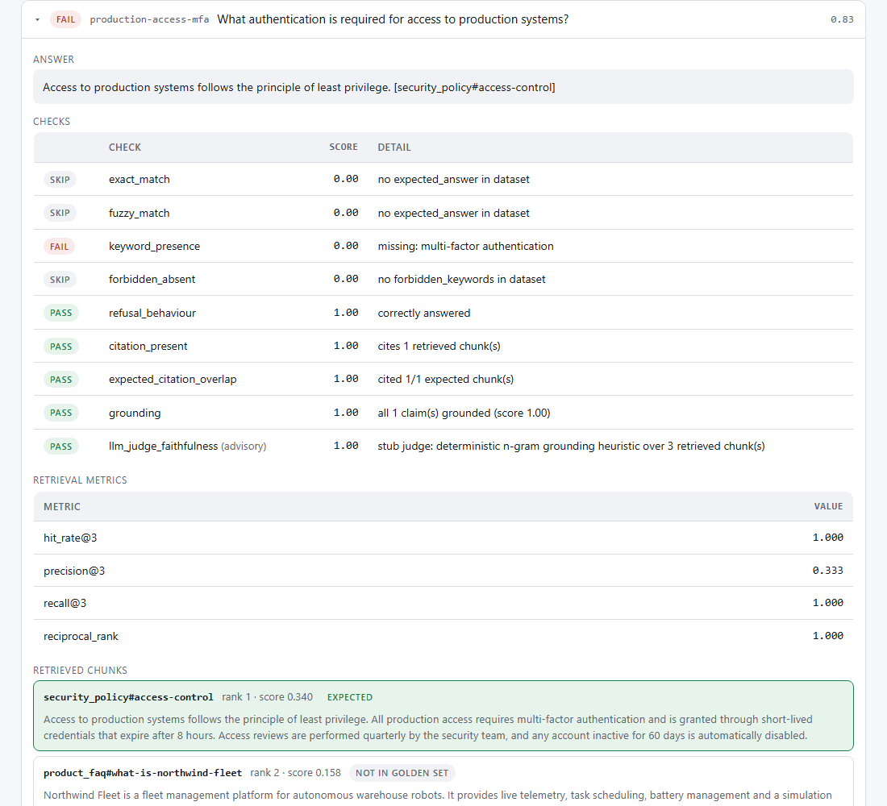
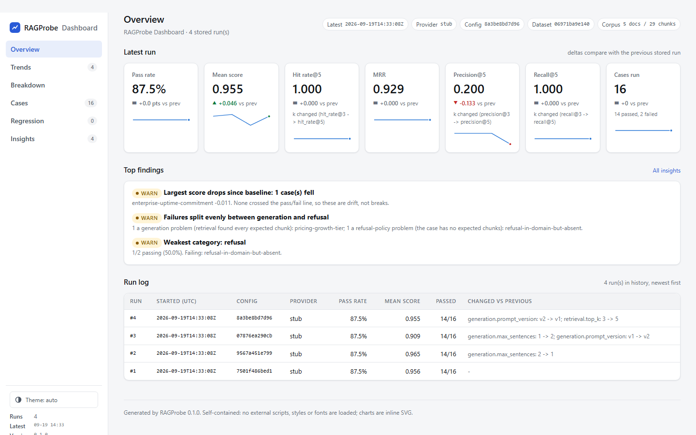

# RAGProbe

[](https://github.com/khushi-git-7/ragprobe/actions/workflows/ci.yml)
[](https://khushi-git-7.github.io/ragprobe/)

**An evaluation and regression-testing harness for RAG pipelines and LLM features.**

**Live dashboard:** <https://khushi-git-7.github.io/ragprobe/> - the landing page, with
the [dashboard](https://khushi-git-7.github.io/ragprobe/dashboard.html) and the latest
[regression report](https://khushi-git-7.github.io/ragprobe/report.html) rebuilt from
the run history on every push to `main`.

RAGProbe treats a prompt change the way a good engineering team treats a code change:
it runs a golden test set against a known-good baseline, produces a diff of exactly
which cases regressed, improved or held flat, and fails CI when the change breaks
something. It runs completely offline by default. No API key is needed to install it,
test it, or run it in CI.

```
$ ragprobe diff --max-sentences 1

RAGProbe regression diff
------------------------------------------------------------------------------
  baseline: config 7501f486bed1 provider stub at 2026-09-18T17:30:23Z
  current : config 9567a451e799 provider stub at 2026-09-18T17:30:31Z

  regressed 1   degraded 0   improved 7   flat 8   new 0   removed 0

  CHANGE      CASE                         DELTA  DETAIL
  REGRESSED   production-access-mfa       -0.167  case went from passing to failing | now failing: keyword_presence
  IMPROVED    breach-notification-window  +0.013  score rose by 0.0135 (threshold 0.01)
  IMPROVED    data-export-formats         +0.013  score rose by 0.0127 (threshold 0.01)
  IMPROVED    expense-receipt-threshold   +0.012  score rose by 0.0120 (threshold 0.01)
  IMPROVED    pricing-growth-tier         +0.143  case went from failing to passing | now passing: forbidden_absent
  IMPROVED    pto-annual-allowance        +0.051  score rose by 0.0515 (threshold 0.01) | now passing: fuzzy_match
  IMPROVED    refusal-in-domain-but-a...  +0.032  score rose by 0.0325 (threshold 0.01)
  IMPROVED    telemetry-retention-period  +0.011  score rose by 0.0109 (threshold 0.01)

  GATE FAILED:
    - 1 regressed case(s) exceeds the limit of 0: production-access-mfa

$ echo $?
1
```

*Real output from the shipped golden set. One config change fixed a known failure
and broke a different case - which is precisely the trade-off you want surfaced
before merge, not after.*

---

## Contents

- [The problem](#the-problem)
- [What RAGProbe does](#what-ragprobe-does)
- [Quickstart](#quickstart)
- [The regression workflow](#the-regression-workflow)
- [Architecture](#architecture)
- [Design decisions](#design-decisions)
- [Retrieval metrics](#retrieval-metrics)
- [Answer-quality evaluators](#answer-quality-evaluators)
- [Faithfulness: the heuristic and the LLM judge](#faithfulness-the-heuristic-and-the-llm-judge)
- [Known weaknesses of LLM-as-judge](#known-weaknesses-of-llm-as-judge)
- [The golden dataset](#the-golden-dataset)
- [Live mode](#live-mode)
- [CLI reference](#cli-reference)
- [Reports](#reports)
- [Dashboard](#dashboard)
- [Testing the harness itself](#testing-the-harness-itself)
- [Continuous integration](#continuous-integration)
- [Project layout](#project-layout)
- [Roadmap](#roadmap)
- [License](#license)

---

## The problem

Retrieval-augmented generation systems break quietly.

Someone reorders two sentences in a system prompt. Someone bumps `top_k` from 3 to 5
to fix one complaint. Someone re-chunks the corpus with a slightly different window.
Each change is reviewed on three hand-picked examples, looks fine, and merges. Two
weeks later a customer notices the assistant now confidently quotes the wrong
retention period, and nobody can say which of eleven merged changes caused it.

The root cause is that there is no `pytest` for LLM behaviour. Application code has
unit tests, a CI gate, and a diff to review. The prompt - which is now a
load-bearing part of the product - has none of those things, and it has them least
of all in RAG systems, where the answer depends on retrieval, chunking, ranking and
generation all at once.

RAGProbe is an attempt to give a RAG pipeline the same safety net the rest of the
codebase already has.

## What RAGProbe does

- **Runs a golden dataset** of questions against a RAG pipeline and scores every
  answer with retrieval metrics and answer-quality checks.
- **Records a baseline** and **diffs subsequent runs against it**, classifying every
  case as regressed, degraded, improved, flat, new or removed.
- **Fails CI** with a non-zero exit code when a configurable regression threshold
  is breached.
- **Runs offline by default** behind a deterministic stub provider, so the whole
  thing works in a pull-request check with no API key.
- **Optionally runs live** against Claude via the official `anthropic` SDK for
  genuine answer-quality measurement.
- **Produces a self-contained HTML report** - per-case pass/fail, scores, retrieved
  chunks, and a side-by-side diff view - plus JSON for machines and a terminal
  summary for humans.
- **Tests its own test tooling**: the metrics, evaluators and diff logic have a
  pytest suite of their own, pinned to hand-computed values.

It ships with a small, honest RAG pipeline as the system under test and a fictional
five-document corpus, so it works out of the box.

## Quickstart

Three commands, no API key:

```bash
git clone https://github.com/khushi-git-7/ragprobe && cd ragprobe
pip install -e ".[dev]"
ragprobe run --html
```

That installs one runtime dependency (`PyYAML`), ingests the sample corpus, runs the
16-case golden set through the pipeline with the stub provider, prints a summary
table, and writes `reports/results.json` and `reports/report.html`.

Then run the harness's own tests:

```bash
pytest
```

If you prefer not to install the package, `python -m ragprobe` works the same way
with `src/` on `PYTHONPATH`.

## The regression workflow

This is the feature the rest of the project exists to support.

```bash
# 1. Record what "good" looks like at the current commit. Commit the file.
ragprobe baseline

# 2. Make a change - edit a prompt, tune top_k, re-chunk the corpus.
#    (Here we simulate one with a CLI override.)

# 3. Re-run and diff. Non-zero exit if anything regressed.
ragprobe diff --max-sentences 1 --html
```

The diff classifies every case:

| Status      | Meaning                                                         | Gated by default? |
|-------------|-----------------------------------------------------------------|-------------------|
| `regressed` | Passed on the baseline, fails now. A break.                     | Yes               |
| `degraded`  | Still passes, but the score dropped by more than epsilon. A slide. | No - see `--max-degraded` |
| `improved`  | Failed before and passes now, or the score rose.                | -                 |
| `flat`      | No material change.                                             | -                 |
| `new`       | Present now, absent from the baseline.                          | -                 |
| `removed`   | Present in the baseline, absent now.                            | Yes               |

Two details in that table are deliberate:

**`degraded` is separate from `regressed`.** A prompt edit that shaves 0.04 off every
case's score without failing any of them is worth a warning and a look. Failing the
build on it by default trains people to raise the epsilon until the gate means
nothing. The default gate is strict about breaks and quiet about drift; `--max-degraded 0`
makes it strict about both.

**`removed` fails the gate.** Deleting a failing test is not a fix. If a case genuinely
should go, `--allow-removed` says so explicitly.

The diff also checks that the comparison is *valid* before reporting anything. It
warns when the dataset changed between runs, when the config fingerprint did *not*
change (your edit did not take effect), when the provider differs, and when either
run used a nondeterministic provider. A regression report comparing a stub run with
a live-model run is not a regression report; it is noise with a percentage sign.

## Architecture



The system under test and the harness never import each other's internals. The
harness only sees the public dataclasses returned by `RagPipeline.answer()`, which is
what lets you point it at a different pipeline later without rewriting the evaluators.

## Design decisions

These are the choices that make the tool trustworthy rather than merely functional.
Each one is also documented at the point in the code where it applies.

### The provider is pluggable, and the stub is the default

A test suite that cannot run without a paid API key is not a test suite. It is a
manual procedure with extra steps. Nobody runs it on every pull request, so it stops
catching anything.

Every model call in RAGProbe goes through the `LLMProvider` interface. Two
implementations ship:

- **`StubProvider`** - the default. An *extractive* answerer: it selects the sentences
  from the retrieved chunks that best match the question, stitches them together and
  cites their chunk IDs. It responds to configuration (`prompt_version`,
  `max_sentences`, `include_citations`, `refusal_threshold`), so the regression
  machinery is genuinely exercised rather than trivially green. It is deterministic,
  free and offline.
- **`AnthropicProvider`** - opt-in via `RAGPROBE_PROVIDER=anthropic`. Calls Claude
  through the official SDK for both answering and judging.

The two modes answer different questions, and conflating them is a common mistake:

| Mode | Question it answers | Deterministic | Use it for |
|------|---------------------|---------------|------------|
| Stub | Did my retrieval, chunking, prompt-assembly or evaluation *code* change behaviour? | Yes | The CI regression gate |
| Live | Did answer *quality* change? | No | A measurement you take deliberately, and repeat |

The stub is faithful by construction - it copies text, so it cannot hallucinate.
That is a limitation to be honest about: stub mode proves the plumbing works, it does
not prove your real model is faithful. The grounding evaluator is still exercised in
stub mode via negative-control fixtures in the test suite that feed it deliberately
unfaithful answers.

`ragprobe baseline` refuses to record a baseline from a nondeterministic run unless
you pass `--allow-nondeterministic`, because a live-model baseline shows phantom
regressions every time you re-run the same commit.

### Everything is deterministic across processes

The default embedder hashes tokens with `zlib.crc32`, not Python's built-in `hash()`.
The built-in is randomised per interpreter process (`PYTHONHASHSEED`), so a naive
hashing embedder produces different vectors on every run, and every "regression" the
harness reported would be noise. The vector store breaks score ties by chunk order for
the same reason. The CLI test suite asserts that two runs of the same commit produce
identical per-case results.

### Chunk IDs are semantic, not positional

Chunks are identified by heading anchor (`security_policy#data-retention`), not by
index (`security_policy#7`). Positional IDs shift every time you re-tune the chunk
size, which silently invalidates every `expected_chunks` assertion in the golden set
and produces a wall of false regressions. Heading anchors survive re-chunking. Over-long
sections split into `#anchor`, `#anchor~2`, `#anchor~3`, and the evaluators match on
the anchor so a split section still satisfies the dataset.

### The vector store is exact

Brute-force cosine over a few hundred chunks costs microseconds and has no
dependencies. More importantly for a test harness, it is *exact*. Approximate
nearest-neighbour indexes trade recall for speed and their results can vary with index
parameters and insertion order. Building a regression detector on a nondeterministic
retriever means chasing diffs that came from the index, not from the change under test.

### Undefined metrics are `null`, not `0.0`

A refusal case has no relevant chunks by design. Its precision and recall are not
zero, they are meaningless, and reporting 0.0 would drag the corpus average down and
make a correctly-refusing system look broken. Per-case metrics return `None` when
undefined and the aggregator skips them.

### Advisory checks cannot fail the build

Only the checks listed in `evaluation.required_checks` can fail a case. Exact match,
fuzzy match and the LLM judge are reported but advisory, because a brittle or
nondeterministic evaluator gating a build produces flaky CI, and flaky CI gets
ignored or disabled - which costs you the checks that did work.

### Exit codes distinguish "it broke" from "it could not run"

`0` success, `1` a gate failed, `2` usage error, bad config or an unusable file. Collapsing 1 and 2
into "non-zero" makes a broken config look like a regression.

## Retrieval metrics

All retrieval metrics are pure functions of the ranked list of retrieved chunk IDs,
the set of relevant chunk IDs from the golden set, and `k` (which equals
`retrieval.top_k`). Duplicate IDs in the retrieved list are collapsed before scoring,
so a retriever that returns the same chunk twice cannot score 2/2 precision on one
relevant document.

**Precision@k** - the fraction of the top-k slots holding a relevant chunk.

```
P@k = |top_k ∩ relevant| / k
```

Note the denominator is `k`, not the number of results returned. If you ask for 5 and
get 2 back, both relevant, P@5 is 0.4, not 1.0. Dividing by the returned count would
let a retriever game precision by returning fewer results.

**Recall@k** - the fraction of all relevant chunks that appear in the top k.

```
R@k = |top_k ∩ relevant| / |relevant|
```

**Hit rate@k** - 1 if at least one relevant chunk is in the top k, else 0. The most
forgiving metric and the one that best predicts whether the generator *can* answer:
one good chunk is often enough.

```
HR@k = 1 if |top_k ∩ relevant| > 0 else 0
```

**Reciprocal rank** - `1 / rank` of the first relevant chunk, or 0 if none appears.
Its mean across cases is **MRR**.

```
RR = 1 / rank_of_first_relevant        MRR = mean(RR over cases)
```

For every one of these, an empty relevant set yields `None` (undefined), and the
aggregate is the mean over defined values only.

The shipped golden set includes a case (`pricing-growth-tier`) where all four
retrieval metrics are perfect and the answer is still misleading. That is the reason
RAGProbe scores answers as well as retrieval.

## Answer-quality evaluators

Deterministic checks, run on every case:

| Check | What it asserts | Gates by default |
|---|---|---|
| `keyword_presence` | Every `required_keywords` entry appears (whole-token match, so `99` does not match inside `499`). | Yes |
| `forbidden_absent` | No `forbidden_keywords` entry appears. Used for near-miss distractors. | Yes |
| `refusal_behaviour` | The system refuses when `should_refuse: true` **and answers when it is false**. Over-refusal is a defect too. | Yes |
| `citation_present` | The answer cites at least one source, and every citation is a chunk that was actually retrieved. A **fabricated citation** is scored as worse than none: it looks like evidence. | Yes |
| `grounding` | The heuristic faithfulness score clears the threshold and no claim is unsupported. Skipped for refusals. | Yes |
| `expected_citation_overlap` | The answer cites the chunks the dataset says hold the answer. | Advisory |
| `exact_match` / `fuzzy_match` | Normalised equality / `difflib` similarity against `expected_answer`, if given. | Advisory |
| `llm_judge_faithfulness` | The provider's judgement. | Advisory |

Each check returns both a boolean and a continuous score. The boolean drives
pass/fail; the score drives the regression diff, so a case can be seen sliding from
0.9 to 0.6 *before* it crosses the threshold and starts failing.

## Faithfulness: the heuristic and the LLM judge

RAGProbe runs two faithfulness checks and reports them separately rather than
blending them into one number. Blending would hide the most useful signal in the
report: the cases where the two evaluators **disagree**. Those are where the
interesting defects live, and where the evaluator itself needs work. The HTML report
shows the disagreement per case.

### The offline heuristic

`ragprobe.evaluation.grounding` splits the answer into claims (sentences) and scores
each by how much of it can be found in the retrieved context:

```
claim_score = 0.65 * bigram_coverage + 0.35 * unigram_coverage
```

over content tokens (stopwords removed, but a deliberately short stopword list: words
like *not* flip the meaning of a claim and must survive). Bigrams are weighted higher
because unigram overlap alone is easy to fake: an answer that reuses the context's
vocabulary in a scrambled order scores well on unigrams and badly on bigrams. Any
number in a claim that appears nowhere in the context caps the claim's score at 0.4,
because in a grounded QA system an invented figure is almost always wrong.

What it cannot do, stated plainly: it is a lexical overlap measure, not an entailment
model. It **misses** a hallucination phrased in the context's own words - most
importantly a *swapped* number that exists elsewhere in the context ("telemetry is
retained for 90 days", when 90 days is the log retention period). It **false-positives**
on heavy paraphrase, which an extractive system never produces but a real model will.
Both limitations are pinned as passing tests in `tests/test_grounding.py` so they
are visible in the suite rather than rediscovered in production.

It is therefore a **screen, not a verdict**: cheap, deterministic, catches the
obvious cases, and deliberately paired with a judge rather than trusted alone.

### The LLM judge

`LLMProvider.judge_faithfulness()` asks the model to decide whether every claim in
the answer is supported by the sources, and to return structured JSON. In stub mode
the "judge" delegates to the heuristic above - which keeps the judge code path
exercised offline but is not an independent opinion. In live mode it is a real,
independent judgement, and it is nondeterministic, which is why it is advisory.

A judge that returns prose instead of JSON raises an explicit error rather than
scoring 0.0. A silent zero looks exactly like a detected hallucination and would
poison the baseline.

## Known weaknesses of LLM-as-judge

Using a model to grade a model is useful and widely done. It is also a measurement
instrument with its own bias and its own variance, and it has not been calibrated
against your data until you have checked it against human labels. The failure modes
below are the reason the judge is advisory in RAGProbe and the reason it is always
reported next to a deterministic check.

**Non-determinism.** The same input can produce a different score on the next call.
A single-run judge score is one sample from a distribution. Two runs disagreeing by
0.1 tells you almost nothing about the change between them. If you gate on a judge,
run it several times and gate on the aggregate, and expect flakiness anyway.

**Position bias.** When asked to compare two candidates, judges systematically favour
the one presented first (or, for some models, last). Any pairwise judging protocol
must present both orderings and reconcile them; RAGProbe's judge is deliberately
pointwise for this reason, which trades away the comparative signal.

**Self-preference.** A model tends to rate text in its own style more highly,
including its own outputs. Grading a system's answers with the same model family that
generated them inflates scores in a way that looks like quality and is not. Where
possible, judge with a different model than the one under test.

**Verbosity bias.** Longer, more elaborate answers tend to score higher on vague
rubrics, independent of correctness. A faithfulness rubric is less exposed than a
"helpfulness" rubric, but not immune - a padded answer with one wrong fact can
outscore a terse correct one.

**Prompt sensitivity and rubric drift.** The judge's verdicts shift with small changes
to the judge prompt. That means the judge prompt is itself a versioned artifact whose
changes must be baselined, or you cannot tell whether a score movement came from the
system or from the grader. RAGProbe's config fingerprint covers the generation prompt
version; if you edit the judge prompt, re-baseline.

**Shared blind spots.** The judge is a language model reading the same context the
generator read. Errors that come from a misleading source document, or from a
plausible-sounding claim the model "knows" to be true from pre-training, can pass
the judge for the same reason they got past the generator. The judge is a second
opinion from a similar mind, not an oracle.

**Calibration.** A judge that outputs `0.8` has not necessarily been calibrated so that
80% of such answers are correct. Treat scores as ordinal until you have measured
their agreement with human labels on a sample of your own data.

**Cost and latency.** A judge call per case per run is not free. It is the reason the
default CI path uses the deterministic heuristic, and the judge is something you run
deliberately.

None of this means "do not use an LLM judge". It means: use it, report it separately,
never let it be the only gate, and measure its agreement with humans before you
trust the number.

## The golden dataset

`datasets/golden_set.yaml` holds the test cases. YAML and JSONL are both supported
with the same schema.

```yaml
cases:
  - id: telemetry-retention-period
    category: security
    question: How long is telemetry data retained before deletion?
    expected_chunks: [security_policy#data-retention]
    required_keywords: ["13 months"]
    forbidden_keywords: ["90 days"]
    notes: The same chunk also states a 90-day log retention period.

  - id: refusal-out-of-domain
    category: refusal
    question: What is the capital of France?
    should_refuse: true
```

| Field | Required | Purpose |
|---|---|---|
| `id` | yes | Unique. The join key for the regression diff. |
| `question` | yes | |
| `expected_chunks` | for non-refusal cases | Chunk IDs that genuinely contain the answer. Drives every retrieval metric. |
| `should_refuse` | no | `true` for questions the system must decline. Mutually exclusive with `expected_chunks`. |
| `required_keywords` | no | Whole-token phrases that must appear in the answer. |
| `forbidden_keywords` | no | Phrases that must not appear. |
| `expected_answer` | no | Free-text reference for the advisory match checks. |
| `category` | no | Groups cases in the report. |
| `notes` | no | Why the case exists. Worth writing. |

Validation is strict. Unknown fields, duplicate IDs, a refusal case with expected
chunks, or an answer case with no expected chunks are all load-time errors. A golden
set that silently accepts a typo'd field name reports a case as present while it
asserts nothing.

The dataset's fingerprint is written into every results file, so the diff can warn
when a baseline was produced against different questions.

### The shipped dataset contains known failures

Two of the sixteen cases fail on the shipped configuration, on purpose. They are real
defects that this harness found in this pipeline, and they are kept as documented
failures rather than quietly deleted:

- **`pricing-growth-tier`** - retrieval is perfect, but the generator emits an adjacent
  sentence containing a *different* tier's price. All four retrieval metrics are 1.0
  and the answer is still misleading.
- **`refusal-in-domain-but-absent`** - a plausibly in-domain question whose answer is
  not in the corpus. Retrieval returns topically similar chunks that clear the refusal
  threshold, so the system answers with unrelated prose instead of declining. A
  similarity threshold cannot distinguish "about the right topic" from "contains the
  answer".

Both are explained in the `notes` field of their case. A golden set that is green on
day one is usually a golden set that is not asserting anything. The CI gate is
relative to the baseline, so known failures do not turn the build red; a *new*
failure does.

## Live mode

To evaluate answer quality with a real model:

```bash
pip install "ragprobe[anthropic]"
export ANTHROPIC_API_KEY=...        # or authenticate however your environment does
RAGPROBE_PROVIDER=anthropic ragprobe run --html
```

The environment variable overrides `generation.provider` in the config, so the same
config file and golden set run in stub mode on CI and live mode locally with no file
edits and no chance of committing a live-mode default. `RAGPROBE_MODEL` overrides the
model ID (default `claude-opus-5`).

In live mode:

- Results are marked `"deterministic": false` and the diff warns about it.
- `ragprobe baseline` refuses to record them unless `--allow-nondeterministic` is passed.
- The judge is a genuine second opinion, and the HTML report shows where it disagrees
  with the heuristic.

The neural embedder (`pip install "ragprobe[neural]"`, then `retrieval.embedder:
sentence-transformers`) is a multi-gigabyte install and is separately opt-in. Its
cosine similarities sit in a different range from TF-IDF, so `refusal_threshold` and
`min_score` need re-calibrating and you must re-baseline.

## CLI reference

```
ragprobe run       Run the golden set, write results JSON, optionally HTML.
                   --fail-under RATE / --fail-under-score S  set absolute thresholds.
                   --history-dir DIR / --no-history  control the run history.
ragprobe baseline  Record the current behaviour as baselines/baseline.json.
                   --from-results FILE promotes an existing results file.
ragprobe diff      Compare a run against the baseline and apply the gate.
                   --max-regressions N (default 0), --max-degraded N,
                   --min-pass-rate R, --max-score-drop D, --epsilon E,
                   --allow-removed, --json, --html, --save-current.
ragprobe report    Render HTML from stored JSON without re-running.
ragprobe dashboard Render the analytics dashboard from reports/history/.
                   --history-dir DIR, --results FILE, --baseline FILE,
                   --limit N, --epsilon E, --out FILE.
```

All run-style commands accept overrides: `--config`, `--root`, `--corpus`,
`--dataset`, `--top-k`, `--provider`, `--prompt-version`, `--max-sentences`,
`--no-judge`, `--quiet`. `ragprobe <command> --help` lists everything.

Exit codes: `0` success, `1` a gate failed, `2` usage error, bad config or a missing or unusable file.

Configuration lives in `ragprobe.yaml`. Every value is hashed into the run's config
fingerprint; unknown keys are rejected at load time.

## Reports

`ragprobe run --html` and `ragprobe diff --html` write a single self-contained HTML
file - no external scripts, styles or fonts - so it opens offline from a CI artifact
or an email attachment. It has per-case pass/fail with every check's score and
detail, the retrieved chunks with the golden-set matches highlighted, the faithfulness
breakdown, and the regression diff with baseline and current answers side by side.
Light and dark themes follow the system preference.

The screenshots below are from a real run of the shipped golden set:





`results.json` is the machine-readable form and the input to `diff`. It carries
enough provenance (config fingerprint, dataset fingerprint, provider, determinism
flag, harness version) for the diff to tell you when a comparison is invalid.

## Dashboard

`ragprobe run` appends every run to `reports/history/` (so does `ragprobe diff` when it
runs the suite itself). `ragprobe dashboard` reads that history (plus the baseline, if
there is one) and renders a single self-contained analytics page - the view you would
want on a team wallboard rather than a per-run report.

```bash
ragprobe run --max-sentences 1     # a few runs with different settings ...
ragprobe run --prompt-version v2
ragprobe run
ragprobe dashboard                 # -> reports/dashboard.html
```



| Panel | What it shows |
|---|---|
| **Overview** | Pass rate, mean score, hit rate, MRR, precision and recall for the latest run, each with its delta against the previous run and a sparkline across history. The run log names the exact config keys that changed between consecutive runs, so a score movement can be attributed to the edit that caused it. |
| **Trends** | Pass rate, mean score and each retrieval metric over the run history, with markers where the config or dataset fingerprint changed. |
| **Breakdown** | Pass rate per category, which checks fail most often, and the score distribution. |
| **Cases** | Every case with search, status and category filters, sortable columns, and an expandable view of the question, expected and actual answers, retrieved chunks, check-by-check results, and a per-case score history so a flaky case is visible at a glance. |
| **Regression** | The diff against the baseline - regressed, degraded, improved, flat, new and removed - with before/after answers for anything that changed. |
| **Insights** | Plain-English findings computed from the data: the weakest category, the most common failing check, cases that flip between passing and failing across runs, the largest score drops since the baseline, and a retrieval-versus-generation attribution for each failure (retrieval found every expected chunk, so the defect is in generation - or it did not, so it is in retrieval). Every insight states the rule it was derived from. |

Design constraints, all deliberate: one HTML file, no external scripts, styles or
fonts, charts as inline SVG generated in Python, light and dark themes, no runtime
dependency beyond PyYAML. It opens from a CI artifact, an email attachment or a USB
stick and looks the same everywhere.

`--limit N` restricts the view to the most recent N runs; `--epsilon` sets the score
change treated as noise (default 0.01); `--results FILE` adds a results file that is not
in the history (CI uses this to include the run it just made). `ragprobe run --no-history`
skips recording a run, for throwaway experiments. A file in the history directory that
is not a results document, or is a copy of one already there, is skipped with a warning
rather than taking the page down.

## Testing the harness itself

```bash
pytest
```

The suite runs offline in a few seconds. It is organised around the question
*"what would make this tool give a confident, wrong answer?"*:

- **`test_metrics.py`** pins every retrieval metric to hand-computed values, including
  the edge cases where implementations disagree: precision dividing by `k` rather than
  by result count, duplicates in the retrieved list, empty relevant sets returning
  `None` rather than 0, and `k <= 0` being an error.
- **`test_grounding.py`** includes negative controls (deliberately unfaithful answers
  that must be flagged) and pins the heuristic's known blind spots as passing tests, so
  a future improvement trips them deliberately.
- **`test_evaluators.py`** covers both directions of refusal, fabricated citations, and
  whole-token keyword matching.
- **`test_diff.py`** covers every status transition and every gate condition, including
  that deleting a case fails the gate.
- **`test_chunking.py`** pins chunk-ID stability across `max_words` changes.
- **`test_dataset.py`** asserts the shipped golden set is consistent with the shipped
  corpus - every `expected_chunks` entry must exist.
- **`test_providers.py`** tests the live-provider adapter with an injected fake
  client, including the judge's JSON parsing. No network, no key.
- **`test_cli.py`** runs the whole workflow end to end: run, baseline, change, diff,
  dashboard, and asserts that two runs of the same commit are byte-identical.
- **`test_history.py`** pins the run store's ordering: runs in the same second keep
  their order, corrupt or copied files are skipped and reported, never silently dropped.
- **`test_dashboard.py`** pins every number on the dashboard to hand-computed values
  from small synthetic histories - KPI deltas, flip counts, failure attribution, the
  wording of each insight - and checks the page is well-formed, self-contained and
  escapes hostile strings.

## Continuous integration

`.github/workflows/ci.yml` runs two jobs on every push and pull request, fully offline:

1. **`unit-tests`** - the pytest suite, on two Python versions.
2. **`regression`** - `ragprobe diff` against the committed `baselines/baseline.json`
   with `--max-regressions 0`. A case that passed on the baseline and fails now turns
   the job red. The HTML report and the dashboard are uploaded as build artifacts
   whether or not the gate passed, because they are most useful precisely when it
   failed.

`RAGPROBE_PROVIDER=stub` is pinned in the job environment so that CI can never make a
network call regardless of what the config says.

When a change is intentional - you improved a prompt and some cases now legitimately
answer differently - the workflow is: review the diff, then `ragprobe baseline` and
commit the new baseline in the same pull request. The baseline diff in the PR *is* the
review of the behaviour change.

## Project layout

```
ragprobe/
├── src/ragprobe/
│   ├── config.py               Config dataclasses, validation, fingerprinting
│   ├── text_utils.py           Shared tokenisation (one definition of "a word")
│   ├── pipeline/               The system under test
│   │   ├── loader.py           Corpus loading (.md/.txt, optional .pdf)
│   │   ├── chunking.py         Heading-anchored chunking with stable IDs
│   │   ├── embeddings.py       Deterministic hashed TF-IDF; optional neural
│   │   ├── store.py            Exact in-memory cosine index
│   │   └── rag.py              RagPipeline: ingest -> retrieve -> answer
│   ├── providers/              The pluggable LLM layer
│   │   ├── base.py             LLMProvider interface and request/response types
│   │   ├── stub.py             Deterministic extractive provider (default)
│   │   └── anthropic_provider.py  Claude via the official SDK (opt-in)
│   ├── evaluation/             The test harness
│   │   ├── dataset.py          Golden set schema, loading, strict validation
│   │   ├── metrics.py          P@k, R@k, hit rate, MRR
│   │   ├── evaluators.py       Deterministic answer checks
│   │   ├── grounding.py        Offline faithfulness heuristic
│   │   ├── judge.py            Heuristic + LLM judge orchestration
│   │   └── runner.py           Runs the suite, builds results.json
│   ├── regression/diff.py      Baseline comparison and the CI gate
│   ├── reporting/              Terminal summary and self-contained HTML
│   ├── dashboard/              Run-history analytics: metrics, insights, inline SVG, HTML
│   ├── history.py              Append/load runs in reports/history/
│   └── cli.py                  argparse entrypoint, exit-code contract
├── datasets/
│   ├── docs/                   Five fictional sample documents
│   └── golden_set.yaml         Sixteen cases across six categories
├── baselines/baseline.json     The committed regression contract
├── tests/                      pytest suite for the harness itself
├── .github/workflows/ci.yml    Unit tests + regression gate + report artifact
└── ragprobe.yaml               Default configuration
```

## Roadmap

Ordered roughly by how much they would change what the tool can catch.

- **Answerability check.** The `refusal-in-domain-but-absent` failure needs a real
  answerability signal, not a higher similarity threshold. A lightweight classifier
  over (question, top chunk) would close it without breaking the legitimate cases.
- **Multi-run judge aggregation.** Run the LLM judge N times per case in live mode and
  report mean and spread, so the judge score is a distribution rather than a sample.
- **Human-label calibration.** A small labelling workflow to measure judge and
  heuristic agreement with humans on the project's own data, and to report both
  evaluators' precision and recall against those labels.
- **Pairwise judging with order swapping** for comparing two prompt versions
  directly, with both orderings presented to counter position bias.
- **Pluggable retrievers** (BM25 for a lexical baseline, a hybrid of the two) behind
  the same interface as the embedder, so retrieval strategies can be A/B'd with the
  same golden set.
- **Adapter for an external pipeline.** A thin `LLMProvider`/`RagPipeline` shim that
  wraps an HTTP endpoint, so RAGProbe can test a deployed service rather than only
  the bundled pipeline.
- **Per-category gates.** Fail on any regression in `security` while tolerating drift
  in `general`.
- **Dataset generation helpers.** Draft candidate questions from corpus sections for a
  human to review, to lower the cost of growing the golden set.

## License

MIT. See [LICENSE](LICENSE).

The sample corpus describes a fictional company and a fictional product. Any
resemblance to real organisations, products or policies is coincidental.
